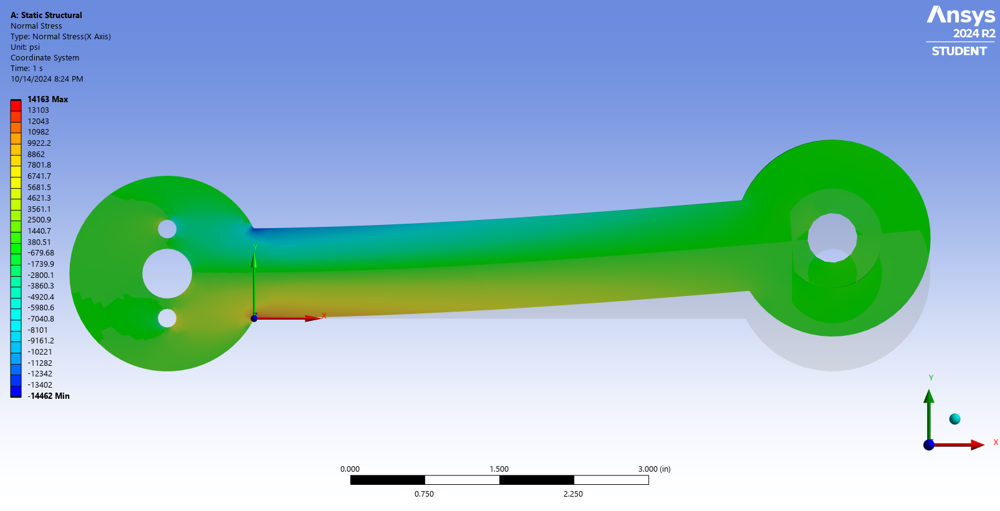
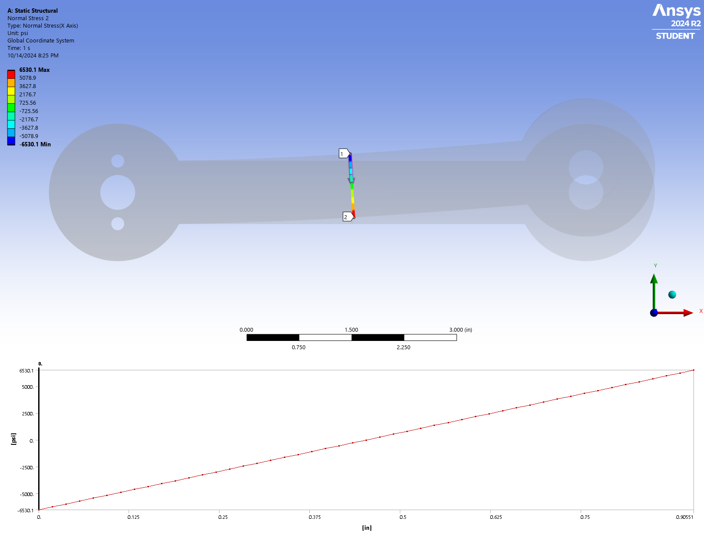

---

# Bike Crank Structural Analysis Using ANSYS

This repository contains the resources and files for performing a structural analysis of a bicycle crank under a static load using ANSYS Mechanical. The objective of the project is to simulate and analyze the deformation and stress distribution of the crank when subjected to a given load.

## Problem Overview

The analysis is based on the **MAE 3250 Analysis of Mechanical and Aerospace Structures** course at Cornell University. The crank, mounted on a bicycle, is made of aluminum 6061-T6 alloy, and it experiences a static upward load of 100 lbf at one end, while the other end is fixed. The analysis aims to examine how the crank deforms and where the stresses are concentrated.

### Material Properties:
- **Material**: Aluminum 6061-T6
- **Young's Modulus**: 1×10^7 psi
- **Poisson's Ratio**: 0.33

### Load and Constraints:
- **Applied Load**: 100 lbf upward on the right hole surface
- **Fixed Boundary**: The left three hole surfaces are fixed.


## Objectives:
- Calculate the **deformed shape** of the crank.
- Analyze the **displacement field**.
- Calculate the **stress distribution** across the crank.
- Systematically verify the results.

---

## Project Structure

```plaintext
Bike-Crank-ANSYS-Structural-Analysis/
├── README.md
├── .gitignore
├── Geometry/
│   └── geometry.pmdb
├── ANSYS_Files/
│   └── crank_analysis.wbpj
├── Results/
    ├── normal_stress_distribution_along_center.png
    ├── total_deformation.png
    ├── total_deformation.mp4
    ├── normal_stress_distribution_along_center.txt
    └── normal_stress_at_A.png

```

### Folder Breakdown:
- **Geometry/**: Contains the CAD model of the crank in `.pmdb` format.
- **ANSYS_Files/**: Contains ANSYS setup files, such as the `.wbpj` or any other relevant files used in the analysis.
- **Results/**: Contains the results generated after running the simulation, including stress distribution and displacement field images.
- **docs/**: Includes documentation files, such as the detailed problem specification and images used in the problem overview.

---

## How to Run the Simulation

1. **Download the Geometry File**: Retrieve the crank geometry from the `Geometry/` folder.
2. **Setup in ANSYS**: Import the geometry into ANSYS Mechanical and configure the boundary conditions and material properties as per the problem specification.
3. **Run the Analysis**: Execute the analysis to simulate the deformation and stress distribution under the applied load.
4. **Results**: Post-process the results to generate images of the deformed shape, stress distribution, and displacement field.

---

## Results

After running the analysis, the following results can be obtained:

- **Deformed Shape**: Visualization of the crank under the applied load.
  
  
- **Stress Distribution**: The stress intensity throughout the crank.
  
  
- **Normal Stress Distribution Along Center**: The Normal Stress Distribution Along Center on the crank under load.
  

---

## Requirements

- **ANSYS Mechanical** (202X or later)
- **Aluminum 6061-T6** material properties in ANSYS
- **Geometry File**: Crank model available in `.pmdb` format
- Basic knowledge of finite element analysis (FEA) and ANSYS software

---

## License

This project is licensed under the MIT License. For more details, see the [LICENSE](LICENSE) file.

---
